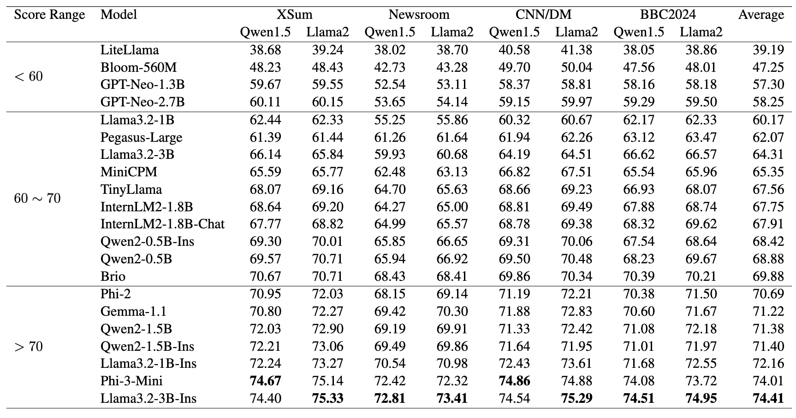

This repo is for the NAACL 2025 main conference paper "Evaluating Small Language Models for News Summarization: Implications and Factors Influencing Performance".

Our findings reveal significant variations in SLM news summarization performance, with top-performing models such as Phi3-Mini and Llama3.2-3B-Instruct achieving results comparable to those of 70B LLMs while generating more concise summaries.

### Outline

The `evaluation_result` folder contains the results for benchmarking small language models on text summarization.

The `dataset` folder contains all the datasets we used for benchmarking.

The `code` folder contains the codes to summarize the news articles (Please modify the dataset path yourself)

### Evaluation Metric

We evaluate the summary quality in relevance, coherence, factual consistency, and text compression using [BertScore](https://huggingface.co/microsoft/deberta-xlarge-mnli), [HHEM-2.1-Open](https://huggingface.co/vectara/hallucination_evaluation_model), and summary length.

### Reference Summary Generation

Since the reference summaries in existing datasets are obtained heuristically and are of relatively low quality, we use news summaries generated by LLMs (Qwen1.5-72B-Chat and
Llama2-70B-Chat) as references.

### Evaluation Result

